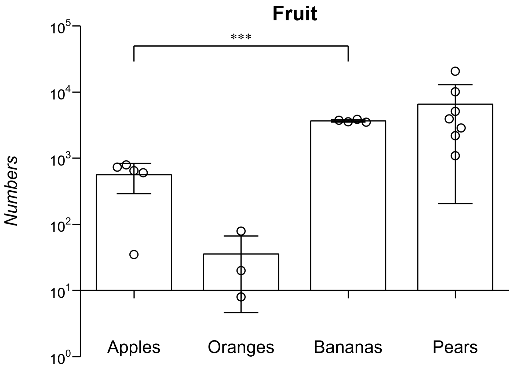
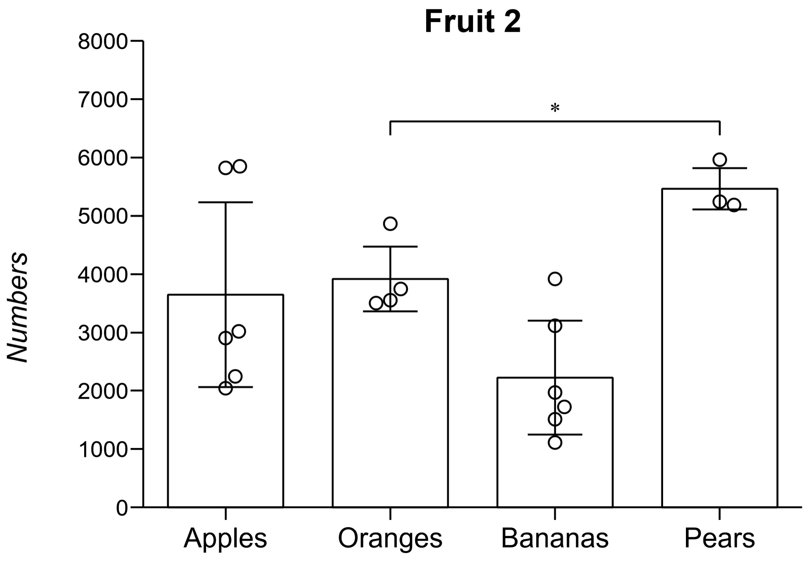

# Categorical Scatter Plot in Bokeh

- Make categorical scatter plots in Python using Bokeh
- Currently supports:
  - Individually dodged points (Credit: allefeld's [circlestack.py](https://gist.github.com/allefeld/f4f5e07b03a7705aa5f3c8aa16b1d393))
  - Error bars
  - One significance bar, automatically calculated by test between two chosen groups (defined in config_and_info.txt)
    - More than one may be supported in the future.
  - Log(10) and linear scales
  - Output to html, png, or svg (see requirements)
  - Different numbers of groups are supported, but this will produce a wider plot.
- Tested in Windows 10, using Python 3.9.12 and libraries' latest versions as of March 2024.
- Example plots:

  
  

## Requirements

These are also detailed in config_and_info.txt

- Data:
  - Text files (.txt) containing tab-delimited values, with a first line of headings.
  - Column headings will determine x axis labels. The text file's name can be used to add a title if add_title = yes in the config.
  - In Windows, making the file can be done by copying a selection in Excel, and pasting into an empty text file.

- Python
  - Tested with Python 3.9.12, but recent versions may work.
  - Choosing to associate files with Python can be helpful.

- Bokeh and Scipy
  - Unless you chose to add Python to environment variables, find your \Python312\Scripts folder.
    - In Windows, it is C:\Users\[USERNAME]\AppData\Local\Programs\Python\Python312\Scripts\ by default.
  - Run a terminal window in the Scripts folder.
    - In Windows, ths may be done by typing 'cmd' into the address bar and pressing enter.
  - Enter 'pip install bokeh' and allow it to complete installation.
  - Then, enter 'pip install scipy'

- Selenium and driver
  - These steps are only necessary if you want to export PNG or SVG files in addition to HTML.
  - The installation steps are described in the [Bokeh docs](https://docs.bokeh.org/en/latest/docs/user_guide/output/export.html), but, in short, they are:
    1. If not using Conda, install Selenium in a similar manner to Bokeh/Scipy ('pip install selenium').
    2. I have only tried the Firefox route, so the rest of these steps may not fully apply to Chrome. Also, I have only tried this using Windows.
    3. Make a folder to hold geckodriver and a Firefox.exe symlink alone.
    4. Download the [geckodriver binary](https://github.com/mozilla/geckodriver/releases) and place it in the folder.
    5. Identify if the symlink step is necessary, by opening a terminal and trying to run the command "firefox". If firefox opens, or a firefox-specific error is returned, you do not need to make a symlink.
    - If "firefox" was not recognized, first, find your firefox.exe file, or the MacOS/linux equivalent. (In Windows, Program Files/Mozilla Firefox by default)
    - Next, make a symlink of the firefox excecutable (eg. firefox.exe) to the folder created in Step 3 in your OS
      - In Windows, [this guide](https://www.howtogeek.com/16226/complete-guide-to-symbolic-links-symlinks-on-windows-or-linux/) may help. I used the program [Link Shell Extension](https://schinagl.priv.at/nt/hardlinkshellext/linkshellextension.html).
    6. Add the folder created in Step 3 to the PATH.
    - In Windows: find Enviromental Variables -> select Path under User Variables -> click Edit -> click New -> enter the folder's path -> click OK/Apply

## Running the script

- First, define values such as y_axis_label, scale, and add_title in config_and_info.txt. This is also where the columns to add a significance bar for is chosen.

- In Windows, dragging and dropping the described data files (one at a time) onto dragdrop.py or dragdrop_svgpng is supported. This may work on other OSes as well, but I am unsure.

- If dragging and dropping does not work, the data file's name may be defined in the config. In this case, the data file must be kept in the same folder as the script.

- In Windows, the included batfile can be used to make plots using all files ending in .txt in the /datafiles folder. Edit out either the third or fourth line if you do not want HTML or SVG/PNG respectively.
